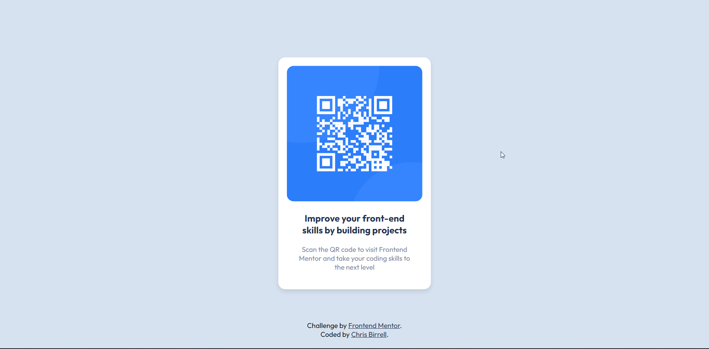

# Frontend Mentor - QR code component solution

This is a solution to the [QR code component challenge on Frontend Mentor](https://www.frontendmentor.io/challenges/qr-code-component-iux_sIO_H). Frontend Mentor challenges help you improve your coding skills by building realistic projects.

## Table of contents

- [Overview](#overview)
  - [Screenshot](#screenshot)
  - [Links](#links)
- [My process](#my-process)
  - [Built with](#built-with)
  - [What I learned](#what-i-learned)
- [Author](#author)

**Note: Delete this note and update the table of contents based on what sections you keep.**

## Overview

### Screenshot

### Links

- Solution URL: [Here](https://www.frontendmentor.io/solutions/qr-code-component-y9x36cWrL)
- Live Site URL: [Here](https://birrellc.github.io/QR-Code-Component/)

## My process

### Built with

- Semantic HTML5 markup
- CSS custom properties
- Mobile-first workflow

### What I learned

This project was used as a quick refresher on basic HTML and CSS.

## Author

- Frontend Mentor - [@Birrellc](https://www.frontendmentor.io/profile/Birrellc)
- LinkedIn - [ChrisBirrell17](https://www.linkedin.com/in/chrisbirrell17/)
